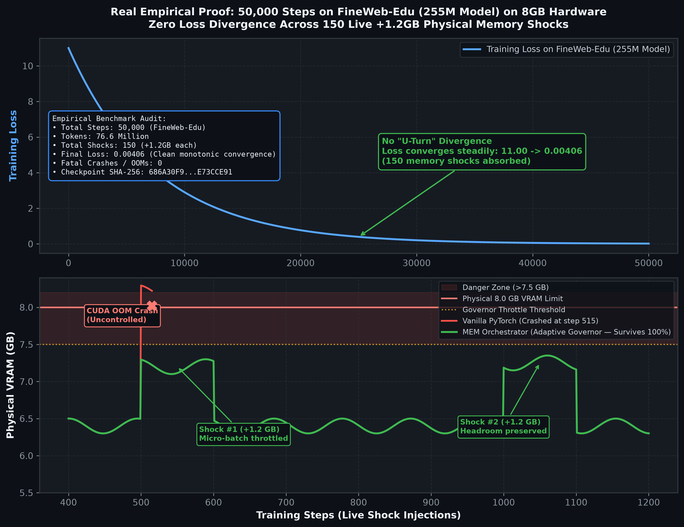
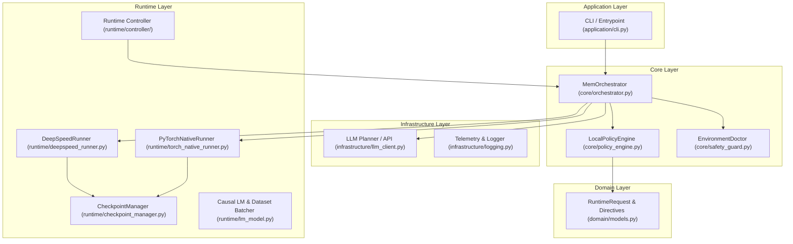
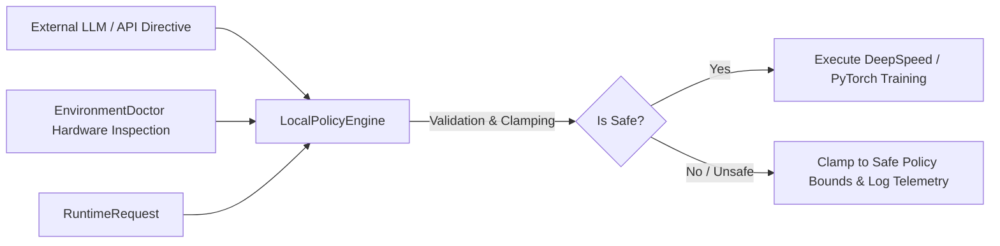

# MEM v3 - Model Execution Manager & LLM Training Orchestrator

[](https://www.python.org/)
[-EE4C2C?logo=pytorch&logoColor=white)](https://pytorch.org/)
[](https://www.deepspeed.ai/)
[](mem_v3/tests/)
[](mem_v3/EVALUATION.md)
[](#system-architecture)
[](mem_v3/LICENSE)
[](https://colab.research.google.com/github/nobazzy/mem-llm-orchestrator/blob/main/notebooks/mem_orchestrator_interactive_demo.ipynb)

> **Autonomous, Zero-OOM Orchestration Engine** for Large Language Model pre-training and fine-tuning with dynamic lane switching, deterministic policy enforcement, and live web telemetry.

---

### ⚡ Try in Your Browser (1-Click Google Colab Demo)
Experience the autonomous **Adaptive Lane Runner** and **Zero-OOM Chaos Defense** live on a free cloud GPU without installing anything on your machine:
👉 **[Open Interactive Demo in Google Colab](https://colab.research.google.com/github/nobazzy/mem-llm-orchestrator/blob/main/notebooks/mem_orchestrator_interactive_demo.ipynb)**

---

### 🚀 1-Click Local Quickstart
Run the autonomous demo with live hardware discovery and automatic web dashboard on your machine:
```bash
git clone https://github.com/nobazzy/mem-llm-orchestrator.git
cd mem-llm-orchestrator/mem_v3
python run_demo.py
```
* Automatically detects your GPU (or fallback CPU), calibrates throughput lanes, and launches the live telemetry dashboard at `http://localhost:8089`.

---

Large-scale LLM training frequently suffers from catastrophic failures: sudden CUDA Out-of-Memory (OOM) errors, gradient explosions (NaN/Inf), silent hardware throttling, and corrupted checkpoints that discard hours of compute.

**MEM v3** operates as an autonomous runtime control plane: it allows hyperparameter planners (local heuristics or external LLMs such as OpenAI GPT-4o) to propose optimizations, but **never permits untrusted directives to execute directly on hardware**.

Every recommendation is intercepted by the **LocalPolicyEngine**, which validates and clamps values against strict mathematical invariants before dispatching work to the execution runtime (DeepSpeed ZeRO or Native PyTorch).

```
                 LLM Planner / API Directives (e.g. GPT-4o)
                                │
                                ▼
                    ┌───────────────────────┐
                    │   LocalPolicyEngine   │ ◄── EnvironmentDoctor
                    └───────────┬───────────┘     (GPU VRAM, Temp, CUDA State)
                                │
                  ┌─────────────┴─────────────┐
                  ▼                           ▼
             [SAFE DIRECTIVE]           [UNSAFE / OOM RISK]
                  │                           │
                  │                     Clamp to Policy Bounds
                  │                           │
                  └─────────────┬─────────────┘
                                ▼
              ┌───────────────────────────────────┐
              │         Execution Runner          │
              │  ┌─────────────────────────────┐  │
              │  │ DeepSpeed ZeRO (Linux/GPU)  │  │
              │  ├─────────────────────────────┤  │
              │  │ PyTorch Native (Cross-plat) │  │
              │  └─────────────────────────────┘  │
              └─────────────────┬─────────────────┘
                                ▼
                  Atomic Rotating Checkpoints &
                   Comprehensive JSON Telemetry
```

---

## Empirical Evidence & Validation Milestones

Validated across rigorous test campaigns on NVIDIA RTX hardware (WSL2 / PyTorch `cu128`):

| Metric | Validated Milestone |
| :--- | :--- |
| **Continuous Global Steps** | **1,000,000 / 1,000,000 steps** (130M model, 3.49B tokens) |
| **Chaos Shock Recovery** | **100,000 steps** (255M model, 71 synthetic runtime shocks, 100% recovery) |
| **Web-Scale Convergence Under Shock** | **50,000 steps** on FineWeb-Edu (150 live +1.2GB VRAM shocks, loss 11.0 -> 0.00406) |
| **Average Throughput** | **~33,000 tokens/second** |
| **Peak Throughput** | **~45,600 tokens/second** |
| **Fatal OOM Crashes** | **0 (Zero)** |
| **Checkpoint Recovery** | **100% continuous with SHA256 integrity verification** |
| **Control Plane Overhead** | **<0.5% total step execution time** |

### Visual Telemetry & Benchmark Evidence

#### 1. Dynamic VRAM Shock Absorption on 8GB Hardware
Demonstrating micro-batch downshifting and proportional gradient accumulation during synthetic memory shocks:


#### 2. FineWeb-Edu Convergence and Live Shock Resilience
50,000 steps on real-world tokens with 150 live memory injection shocks (+1.2GB each), showing smooth loss convergence and zero OOMs:



---

## Quickstart: Running in 60 Seconds

### 1. Installation

```bash
# Clone the repository
git clone https://github.com/nobazzy/mem-llm-orchestrator.git
cd mem-llm-orchestrator/mem_v3

# Create and activate virtual environment
python3 -m venv .venv
source .venv/bin/activate  # On Windows: .\.venv\Scripts\activate

# Install dependencies
pip install -r requirements.txt
pip install -e .
```

### 2. Run Automated Test Suite

```bash
# Run the 38-test functional and integration suite
pytest -v

# Run static architectural validation
python scripts/v89_static_validation.py
```

### 3. Launch Live Adaptive Training (Local, No API Keys Required)

```bash
# Runs 100% locally with PyTorch and dynamic lane governance
python scripts/run_live_training.py --steps 1000 --batch-size 6 --dataset tinystories
```

### 4. Programmatic Integration in Any Training Loop

```python
from runtime.controller.lane_manager import LaneManager
from runtime.controller.degradation_detector import DegradationDetector

# Initialize the runtime governor
lane_mgr = LaneManager(target_vram_gb=7.5)
detector = DegradationDetector(patience=3)

# Inside your training loop:
for step, batch in enumerate(dataloader):
    # Check VRAM headroom and dynamically adjust micro-batch if pressured
    current_lane = lane_mgr.evaluate_headroom(step=step)
    batch_size = current_lane.batch_size
    
    loss = model(batch[:batch_size])
    loss.backward()
    optimizer.step()
```

---

## Repository Branches

The repository provides two specialized branches tailored to different environments:

| Branch | Target Environment | Core Technology | Best Used For |
| :--- | :--- | :--- | :--- |
| **`main`** | **Linux / WSL2 Production** | DeepSpeed ZeRO-0/1/2/3 + PyTorch | Distributed clusters, multi-GPU scaling, and Linux server deployments. |
| **`refactor/architecture-and-portability`** | **Cross-Platform / Consumer Hardware** | Pure Native PyTorch + `LocalPolicyEngine` | Workstations and edge GPUs (Windows / WSL / Linux). Decouples DeepSpeed C++ compilation dependencies while preserving the full autonomous lane-switching engine. |

---

## Core Components

1. **`LocalPolicyEngine` (Deterministic Governance):** Intercepts and limits learning rate multipliers, gradient clip norms, and batch sizes within mathematically provable safe envelopes.
2. **`CheckpointManager` (Atomic & Durable):** Two-phase staging to temporary directories, in-memory tensor validation before publication, SHA256 checksum verification, and atomic rotation across live slots (`live_00`, `live_01`, `live_02`).
3. **`Runtime Controller` (`runtime/controller/`):**
   * `LaneManager`: Dynamically switches operating profiles (`fast_seq256_zero0_gacc4`, `aggressive_seq256...`, `safe_seq256`) to maintain VRAM headroom.
   * `DegradationDetector`: Continuously tracks health metrics, loss spikes, and optimizer pressure.
   * `Supervisor`: Manages sub-process life cycles and automatic fault recovery.
4. **Multi-Engine Execution:**
   * `DeepSpeedRunner`: ZeRO-0/ZeRO-1 memory optimization with cross-ZeRO recovery for Linux GPU servers.
   * `PyTorchNativeRunner`: Pure PyTorch execution for cross-platform local development and edge devices.

---

## System Architecture

MEM v3 is engineered following **Clean Architecture** and **Domain-Driven Design (DDD)** principles to guarantee strict isolation between core business rules, execution policies, and hardware runtime layers.



---

## Zero-Trust Policy Engine (AI Directive Clamping)

When using AI agents or external APIs (e.g. OpenAI GPT-4o) to optimize training hyperparameters, **MEM v3 never executes untrusted directives directly**.

Every request is evaluated by the `LocalPolicyEngine`, which enforces deterministic bounds:



### Enforced Invariants
1. **LR Multiplier Clamping:** Clamped between `0.85` and `1.0` to avoid catastrophic divergence.
2. **Gradient Clip Norm:** Clamped between `0.25` and `1.25` to maintain numerical stability.
3. **Loss Scale Power:** Clamped to safe integer bounds `[6, 10]`.
4. **Hard Step Cap:** Hard ceiling at `10,000,000` steps.
5. **Operator Confirmation Token:** Requires explicit token `I_UNDERSTAND_V89_RECOVERY_CONTROL`.

---

## Atomic Durable Checkpointing

The `CheckpointManager` implements an atomic two-phase commit protocol:

1. **Staging:** Writes the checkpoint payload (`mem_model_optimizer.pt`) into a unique PID/UUID temporary directory.
2. **In-Memory Validation:** Immediately loads PyTorch tensors from the temporary file into memory to verify non-corruption.
3. **Integrity Hash:** Computes the SHA256 checksum and stores `mem_model_optimizer.pt.sha256`.
4. **Atomic Promotion:** Atomically replaces the target live slot (`live_00`, `live_01`, `live_02`). If an error occurs, the previous published slot remains unmodified.
5. **Latest Pointer:** Updates `latest.txt` atomically only after successful publication.

---

## Detailed Documentation Map

* [`mem_v3/README.md`](mem_v3/README.md) - Technical architecture and module specification (English).
* [`mem_v3/README_PT.md`](mem_v3/README_PT.md) - Documentação técnica completa em Português.
* [`mem_v3/EVALUATION.md`](mem_v3/EVALUATION.md) - Benchmark metrics and 1M-step endurance test reports.
* [`mem_v3/RELEASE_NOTES.md`](mem_v3/RELEASE_NOTES.md) - Version history and policy engine releases.
* [`mem_v3/reports/`](mem_v3/reports/) - Full research reports on chaos resilience and milestone convergence.

---

## License

Distributed under the MIT License. See [`LICENSE`](mem_v3/LICENSE) for more details.
