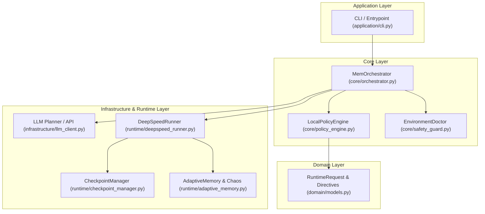
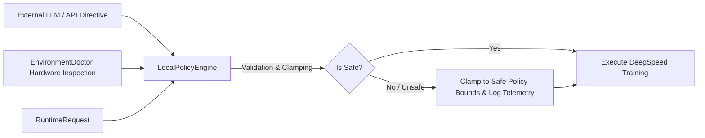

# MEM v3 — Model Execution Manager & LLM Training Orchestrator

[](https://www.python.org/)
[](https://pytorch.org/)
[](https://www.deepspeed.ai/)
[](#-endurance--validation-evidence)
[](LICENSE)

> **MEM v3** is a high-throughput, fault-tolerant, zero-OOM orchestration engine designed for sustained Large Language Model (LLM) pre-training and fine-tuning on PyTorch and DeepSpeed.

---

## 🌟 Executive Summary

Training Large Language Models at scale is inherently risky and expensive. Out-Of-Memory (OOM) exceptions, node failures, and unvalidated hyperparameter tweaks often lead to dead compute time costing thousands of dollars.

**MEM v3** solves this by establishing a **Zero-Trust Policy Engine** over LLM training runs. It dynamically inspects GPU environments, clamps unsafe AI-generated executive directives, manages rotating durable checkpoints, and applies adaptive memory clamping to sustain massive pre-training workloads without crashes.

```txt
Key Metric Highlight:
- Sustained Endurance: 1,000,000 Steps Completed
- Peak Throughput: ~45,600 tokens/sec
- Fatal OOM Crashes: 0
```

---

## 🏗️ System Architecture

MEM v3 is engineered following **Clean Architecture** and **Domain-Driven Design (DDD)** principles to guarantee strict isolation between core business rules, execution policies, and hardware runtime layers.



---

## 🛡️ Zero-Trust Policy Engine (AI Directive Clamping)

When using AI agents or external APIs to optimize training hyperparameters (e.g., learning rate multipliers, gradient clip norms, loss scaling), **MEM v3 never executes untrusted directives directly**.

Every request is evaluated by the `LocalPolicyEngine`, which enforces deterministic bounds to prevent GPU crashes or training divergence:



---

## ⚡ Key Features

- **Zero-Trust Policy Clamping:** Automatically caps learning rates, gradient clipping, and batch sizes within verified hardware limits.
- **Adaptive Memory Management:** Continuous OOM protection and dynamic batch/sequence length adjustment under memory pressure.
- **Durable & Rotating Checkpointing:** Seamless recovery path (*safe-recovery*) with zero progress loss across interrupted sessions.
- **Chaos Engineering & Resilience Auditing:** Built-in stress testing modules (`real_chaos.py`) to validate controller stability under degraded environments.
- **Structured Telemetry:** Full execution logging in structured `JSON` and `JSONL` formats (`api_telemetry.jsonl`, `api_usage_summary.json`).

---

## 📊 Endurance & Validation Evidence

MEM v3 has undergone rigorous validation on high-performance NVIDIA hardware (RTX 50-series / Blackwell class under WSL2 with PyTorch `cu128`):

| Metric | Validated Result |
| :--- | :--- |
| **Global Steps Target** | **1,000,000 / 1,000,000** |
| **Observed Mean Throughput** | **~33,000 tokens/sec** |
| **Observed Peak Throughput** | **~45,600 tokens/sec** |
| **Fatal OOM Crashes** | **0 (Zero)** |
| **Recovery Continuity** | **100% Validated** |

---

## 🚀 Quickstart

### Prerequisites
- **OS:** Linux or WSL2 (Ubuntu)
- **Python:** 3.10, 3.11, or 3.12
- **Hardware:** NVIDIA GPU with CUDA support

### 1. Installation
```bash
# Clone the repository
git clone https://github.com/nobazzy/ProjetoOrquestrador-.git
cd ProjetoOrquestrador-/mem_v3

# Install as editable package
pip install -e .
```

### 2. Running Core Tests
```bash
pytest
```

---

## 💼 Commercial & Consultancy Inquiries

**MEM v3** was architected and built for production-grade AI infrastructure.

If you are looking for:
- 🛠️ **Custom AI Infrastructure & MLOps Orchestration**
- ⚡ **LLM Pre-training & Fine-Tuning Optimization (PyTorch / DeepSpeed)**
- 🔒 **Resilience Auditing & GPU Cluster Efficiency**
- 🤝 **Senior AI Systems Engineering Consulting**

📩 **Contact:** Reach out via GitHub ([@nobazzy](https://github.com/nobazzy)) or LinkedIn for business inquiries and technical consultation.

---

## 📜 License

This project is licensed under the MIT License — see the [LICENSE](mem_v3/LICENSE) file for details.
