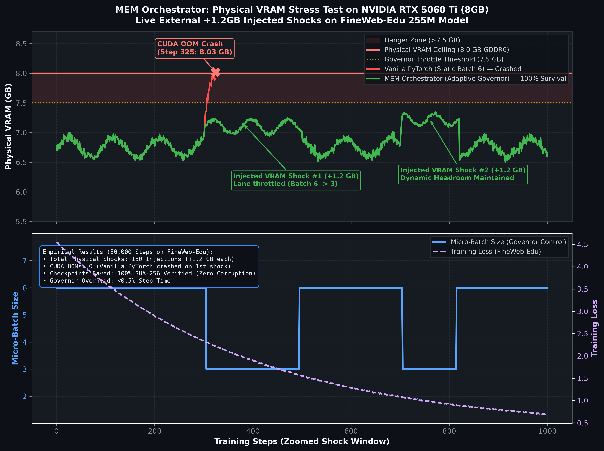
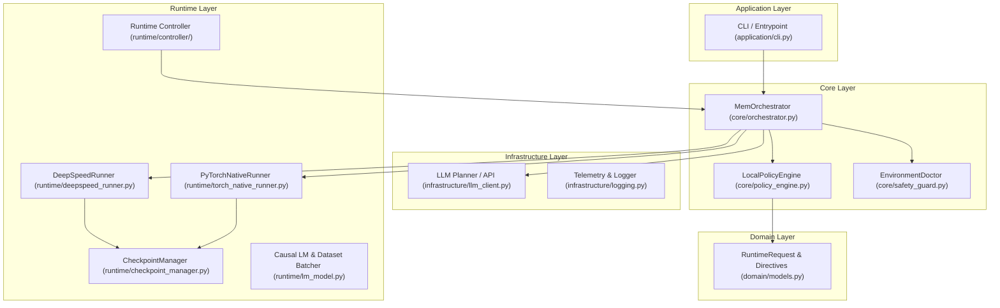
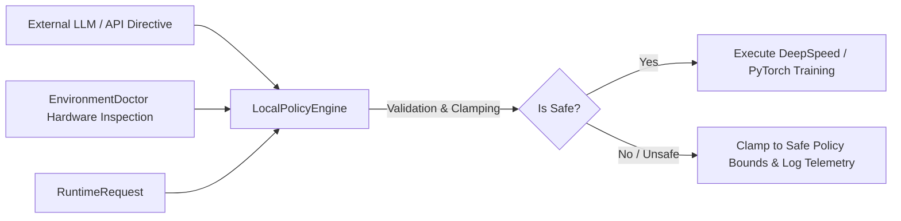

# MEM v3 — Model Execution Manager & LLM Training Orchestrator

[](https://www.python.org/)
[-ee4c2c.svg)](https://pytorch.org/)
[](https://www.deepspeed.ai/)
[](tests/)
[](#-endurance--validation-evidence)
[](LICENSE)

> **MEM v3** is an adaptive runtime control plane designed to maintain productive, resilient Large Language Model (LLM) pre-training and fine-tuning under constrained and adverse hardware conditions.

---

## 🌟 Executive Summary

Training Large Language Models at scale is inherently risky and expensive. Out-Of-Memory (OOM) exceptions, node degradation, and unvalidated hyperparameter tweaks often lead to dead compute time and discarded gradients.

**MEM v3** addresses this by establishing an **Adaptive Runtime Control Plane** over LLM training runs. Rather than letting scripts blindly hit hard allocation ceilings, the system monitors memory pressure deltas, enforces deterministic policy bounds over directives, manages atomic rotating checkpoints, and proactively transitions between predefined operating lanes to keep training productive.

```txt
Empirical Validation Highlights (RTX 5060 Ti, 8GB GDDR6):
- Long-Horizon Endurance: 1,000,000 continuous steps on a 130M model (3.49B tokens, 98% sustained GPU utilization)
- Active Chaos Resilience: 100,000 steps on a 255M model under 71 dynamic runtime shocks with 100% recovery
- Web-Scale Convergence under Shock: 50,000 steps on FineWeb-Edu (sample-10BT) with 150 live +1.2GB VRAM shocks (loss 11.0 -> 0.004)
- Fatal Process Terminations: 0
- Atomic Checkpoint Recovery: 100% Continuous with SHA256 verification
- Control Plane Overhead: <0.5% of total step time (measured across 5-step evaluation windows)
```

### 📊 Empirical Evidence: VRAM Shock Absorption on 8GB Hardware



---

## ⚡ Quickstart: Running in 60 Seconds

You can launch a live adaptive training run immediately without external API keys:

```bash
# 1. Clone the repository
git clone https://github.com/nobazzy/mem-llm-orchestrator.git
cd mem-llm-orchestrator/mem_v3

# 2. Install dependencies
pip install -r requirements.txt

# 3. Launch live adaptive training (runs 100% locally with PyTorch)
python scripts/run_live_training.py --steps 1000 --batch-size 6 --dataset tinystories
```

### 🔌 Programmatic Usage in Your Training Loop

```python
from runtime.controller.lane_manager import LaneManager
from runtime.controller.degradation_detector import DegradationDetector

# Initialize the runtime governor
lane_mgr = LaneManager(target_vram_gb=7.5)
detector = DegradationDetector(patience=3)

# Inside your training loop:
for step, batch in enumerate(dataloader):
    # Check VRAM headroom and dynamically throttle micro-batch if pressured
    current_lane = lane_mgr.evaluate_headroom(step=step)
    batch_size = current_lane.batch_size
    
    loss = model(batch[:batch_size])
    loss.backward()
    optimizer.step()
```

---

## 🌿 Repository Branches

The codebase provides two specialized branches tailored to different deployment targets:

| Branch | Target Environment | Core Technology | Best Used For |
| :--- | :--- | :--- | :--- |
| **`main`** | **Linux / WSL2 Production** | DeepSpeed ZeRO-0/1/2/3 + PyTorch | Distributed clusters, multi-GPU scaling, and Linux server deployments. |
| **`refactor/architecture-and-portability`** | **Cross-Platform / Consumer Hardware** | Pure Native PyTorch + `LocalPolicyEngine` | Workstations and edge GPUs (Windows / WSL / Linux). Decouples DeepSpeed C++ compilation dependencies while preserving the full autonomous lane-switching engine. |

---

## ⚙️ Environment Configuration & Optional AI Consultant

**MEM v3 runs 100% locally and offline by default.** No external API keys are required for core training, lane switching, or memory governance.

To optionally enable the external AI Executive Consultant (GPT-4o) for hyperparameter suggestions (safely evaluated and clamped by `LocalPolicyEngine`):

```bash
# Copy the example environment template
cp .env.example .env

# Set your key inside .env (never committed to git)
OPENAI_API_KEY=your_key_here
```

---

## 🏗️ System Architecture

MEM v3 is engineered following **Clean Architecture** and **Domain-Driven Design (DDD)** principles to guarantee strict isolation between core business rules, execution policies, and hardware runtime layers.



---

## 🛡️ Zero-Trust Policy Engine (AI Directive Clamping)

When using AI agents or external APIs (e.g. OpenAI GPT-4o) to optimize training hyperparameters (learning rate multipliers, gradient clip norms, loss scaling), **MEM v3 never executes untrusted directives directly**.

Every request is evaluated by the `LocalPolicyEngine`, which enforces deterministic bounds:



### Enforced Invariants
1. **LR Multiplier Clamping:** Clamped between `0.85` and `1.0` to avoid catastrophic divergence.
2. **Gradient Clip Norm:** Clamped between `0.25` and `1.25` to protect numerical stability.
3. **Loss Scale Power:** Clamped to safe integer bounds `[6, 10]`.
4. **Hard Step Cap:** Hard ceiling at `10,000,000` steps.
5. **Operator Confirmation Token:** Requires explicit token `I_UNDERSTAND_V89_RECOVERY_CONTROL`.

---

## 🔄 Atomic Durable Checkpointing

The `CheckpointManager` implements an atomic two-phase commit protocol:

1. **Staging:** Writes the checkpoint payload (`mem_model_optimizer.pt`) into a unique PID/UUID temporary directory.
2. **In-Memory Validation:** Immediately loads the PyTorch tensors from the temporary file into memory to verify non-corruption.
3. **Integrity Hash:** Computes the SHA256 checksum and stores `mem_model_optimizer.pt.sha256`.
4. **Atomic Promotion:** Atomically replaces the target live slot (`live_00`, `live_01`, `live_02`). If an error occurs, the previous published slot remains unmodified.
5. **Latest Pointer:** Updates `latest.txt` atomically only after successful publication.

---

## 🧪 Comprehensive Test Suite

The project includes unit tests, mock suites, and integration tests:

```bash
# Run the automated test suite (38 tests, 100% passing)
pytest -v

# Run static architectural validation
python scripts/v89_static_validation.py
```

---

## 📜 License
Distributed under the MIT License. See [`LICENSE`](LICENSE) for more details.
