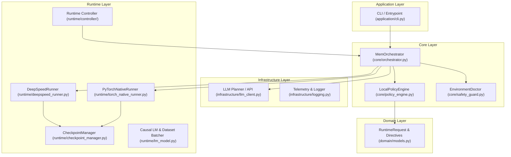
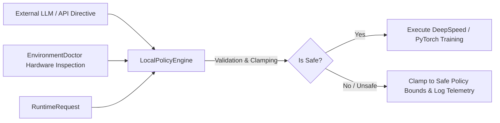

# MEM v3 — Model Execution Manager & LLM Training Orchestrator

[](https://www.python.org/)
[-ee4c2c.svg)](https://pytorch.org/)
[](https://www.deepspeed.ai/)
[](tests/)
[](#-endurance--validation-evidence)
[](LICENSE)

> **MEM v3** is a high-throughput, fault-tolerant, zero-OOM orchestration engine designed for sustained Large Language Model (LLM) pre-training and fine-tuning on PyTorch and DeepSpeed.

---

## 🌟 Executive Summary

Training Large Language Models at scale is inherently risky and expensive. Out-Of-Memory (OOM) exceptions, node failures, and unvalidated hyperparameter tweaks often lead to dead compute time costing thousands of dollars.

**MEM v3** solves this by establishing a **Zero-Trust Policy Engine** over LLM training runs. It dynamically inspects GPU environments, clamps unsafe AI-generated executive directives, manages rotating durable checkpoints, and applies adaptive memory clamping to sustain massive pre-training workloads without crashes.

```txt
Key Metric Highlight:
- Sustained Endurance: 1,000,000 Steps Completed
- Peak Throughput: ~45,600 tokens/sec
- Fatal OOM Crashes: 0
- Atomic Checkpoint Recovery: 100% Continuous with SHA256 verification
```

---

## 🏗️ System Architecture

MEM v3 is engineered following **Clean Architecture** and **Domain-Driven Design (DDD)** principles to guarantee strict isolation between core business rules, execution policies, and hardware runtime layers.



---

## 🛡️ Zero-Trust Policy Engine (AI Directive Clamping)

When using AI agents or external APIs (e.g. OpenAI GPT-4o) to optimize training hyperparameters (learning rate multipliers, gradient clip norms, loss scaling), **MEM v3 never executes untrusted directives directly**.

Every request is evaluated by the `LocalPolicyEngine`, which enforces deterministic bounds:



### Enforced Invariants
1. **LR Multiplier Clamping:** Clamped between `0.85` and `1.0` to avoid catastrophic divergence.
2. **Gradient Clip Norm:** Clamped between `0.25` and `1.25` to protect numerical stability.
3. **Loss Scale Power:** Clamped to safe integer bounds `[6, 10]`.
4. **Hard Step Cap:** Hard ceiling at `10,000,000` steps.
5. **Operator Confirmation Token:** Requires explicit token `I_UNDERSTAND_V89_RECOVERY_CONTROL`.

---

## 🔄 Atomic Durable Checkpointing

The `CheckpointManager` implements an atomic two-phase commit protocol:

1. **Staging:** Writes the checkpoint payload (`mem_model_optimizer.pt`) into a unique PID/UUID temporary directory.
2. **In-Memory Validation:** Immediately loads the PyTorch tensors from the temporary file into memory to verify non-corruption.
3. **Integrity Hash:** Computes the SHA256 checksum and stores `mem_model_optimizer.pt.sha256`.
4. **Atomic Promotion:** Atomically replaces the target live slot (`live_00`, `live_01`, `live_02`). If an error occurs, the previous published slot remains unmodified.
5. **Latest Pointer:** Updates `latest.txt` atomically only after successful publication.

---

## 🧪 Comprehensive Test Suite

The project includes unit tests, mock suites, and integration tests:

```bash
# Run the 33 automated tests
pytest -v

# Run static architectural validation
python scripts/v89_static_validation.py
```

---

## 📜 License
Distributed under the MIT License. See [`LICENSE`](LICENSE) for more details.
